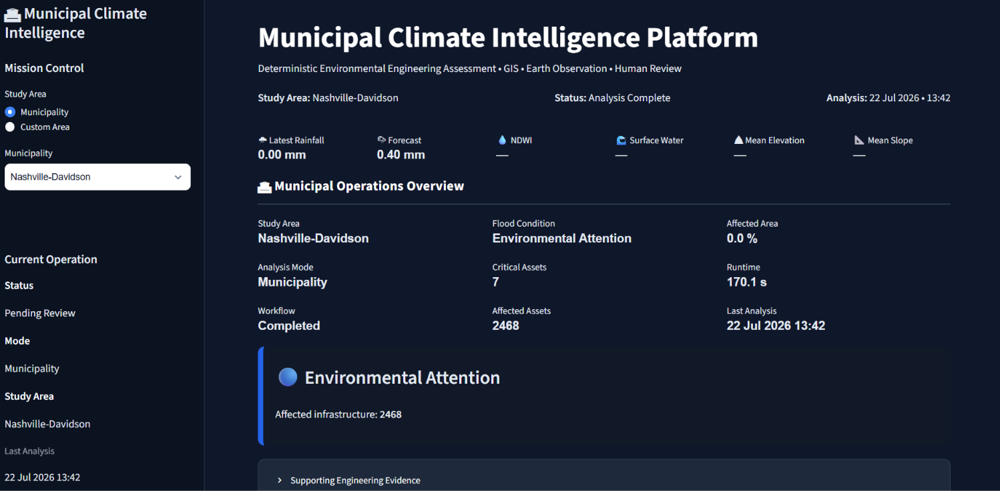
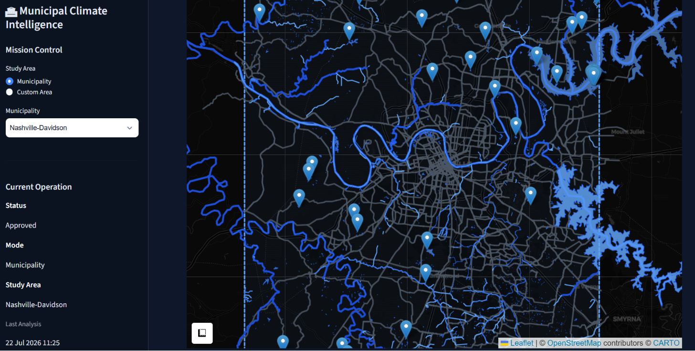
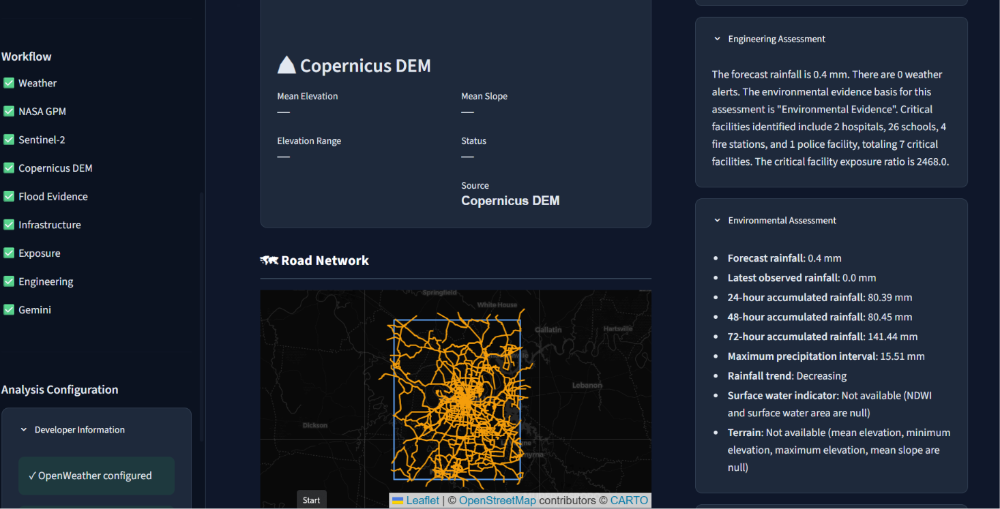

# Municipal Climate Intelligence Platform

Municipal Climate Intelligence Platform is an open-source Human-in-the-Loop decision support system for municipal infrastructure and environmental assessment.

The platform combines weather observations, satellite Earth observation, terrain analysis, geospatial infrastructure data, deterministic engineering workflows, and AI-generated engineering summaries into a single operational dashboard.

Operational decisions remain the responsibility of authorized personnel.

The system is **not** a flood prediction model.

The system does **not** recommend emergency actions.

The AI summarizes engineering findings.

---

# Mission

Provide municipal emergency managers with evidence-based infrastructure intelligence through deterministic engineering analysis and AI-assisted communication.

---

## Live Demo

A live demonstration of the platform is available via Streamlit Community Cloud.

**Live Application**

https://municipal-climate-intelligence-platform.streamlit.app/

---

# Architecture

```
Study Area

↓

OpenWeather

↓

NASA GPM

↓

Sentinel-2

↓

Copernicus DEM

↓

Environmental Assessment

↓

Flood Assessment

↓

OpenStreetMap Infrastructure

↓

Exposure Assessment

↓

Engineering Assessment

↓

Gemini Infrastructure Review Brief

↓

Human Review

↓

SQLite Registry
```

---

# Engineering Principles

## Deterministic Engineering

Engineering calculations are performed using Python.

Examples include:

- Rainfall assessment
- Surface water analysis
- Terrain assessment
- Infrastructure assessment
- Spatial analysis
- Exposure assessment

The LLM performs no engineering calculations.

---

## Human Authority

The AI never:

- predicts flooding
- recommends evacuations
- recommends emergency actions
- communicates with the public
- replaces municipal decision makers

Every report requires explicit human approval.

---

## Explainable AI

Every statement produced by Gemini originates from deterministic structured findings.

The AI only communicates engineering evidence.

---

# Features

- OpenWeather Forecast Integration
- Environmental Evidence Assessment
- OpenStreetMap Infrastructure
- GeoPandas Spatial Analysis
- Interactive GIS Dashboard
- Earth Observation Dashboard
- NASA GPM Integration (initial)
- Infrastructure Review Brief
- Human Review Workflow
- SQLite Report Registry
- Historical Operations Dashboard
- Sentinel-2 Surface Water Analysis
- Copernicus DEM Terrain Analysis
- Custom Study Area Analysis
- PDF Engineering Report Export

---

# Screenshots

## Operations Dashboard



The main operational interface provides an integrated view of environmental conditions, infrastructure assessment, and municipal engineering intelligence.

---

## Earth Observation Center



Earth observation integrates NASA GPM precipitation, Sentinel-2 surface water assessment, and Copernicus DEM terrain analysis into deterministic engineering evidence.

---

## Infrastructure Review Brief



AI-generated engineering summaries are derived exclusively from deterministic findings and require explicit human review before operational use.

# Repository

```
municipal-climate-intelligence-platform/

analysis/
earth_observation/
ui/
data/
tests/

app.py
requirements.txt
Dockerfile
```

---

# Technology Stack

- Python
- Streamlit
- GeoPandas
- Shapely
- OSMnx
- Folium
- OpenWeather API
- NASA GPM
- NASA Earthdata
- Sentinel-2 (Microsoft Planetary Computer)
- Copernicus DEM
- Google Gemini
- SQLite
- Docker
- Google Cloud Run

---

# Environment Variables

Create a `.env` file (or configure the equivalent environment variables in your deployment platform).

The following secrets are required:

```text
OPENWEATHER_API_KEY=
GEMINI_API_KEY=
EARTHDATA_USERNAME=
EARTHDATA_PASSWORD=

GEMINI_MODEL=gemini-2.5-flash
```

> **Note**
>
> API keys and credentials are **not included** in this repository.
> They must be obtained from their respective providers and configured locally or through your deployment platform (for example, Streamlit Community Cloud or Google Cloud Run).

---

# Local Development

Install dependencies

```bash
pip install -r requirements.txt
```

Run

```bash
streamlit run app.py
```

---

# Testing

Run the complete test suite

```bash
pytest
```

Run with coverage

```bash
pytest --cov=analysis
```

---

# Docker

Build

```bash
docker build -t municipal-climate-agent .
```

Run

```bash
docker run \
-p 8080:8080 \
--env-file .env \
municipal-climate-agent
```

---

# Google Cloud Run

Build

```bash
gcloud builds submit \
--tag gcr.io/PROJECT_ID/municipal-climate-agent
```

Deploy

```bash
gcloud run deploy municipal-climate-agent \
--image gcr.io/PROJECT_ID/municipal-climate-agent \
--platform managed \
--allow-unauthenticated \
--region us-central1 \
--set-env-vars OPENWEATHER_API_KEY=YOUR_KEY,GEMINI_API_KEY=YOUR_KEY
```

---

# Kaggle Submission

The submission demonstrates:

- Human-in-the-Loop AI
- Deterministic engineering analysis
- Interactive municipal GIS dashboard
- Infrastructure intelligence
- Explainable AI summaries
- Registry-backed review workflow
- Earth Observation integration

---

# Future Roadmap

- Additional municipalities
- Enhanced environmental evidence visualization
- Performance optimization
- Multi-event historical analysis
- Additional infrastructure categories
- Automated quality assurance tests
- Historical climate analytics
- Environmental indicators
- Asset filtering
- Interactive infrastructure selection
- Multi-event analytics

The Human-in-the-Loop architecture remains unchanged.

# Citation

If this software contributes to research, publications, public reports, or derivative software, please cite the original repository.

**Repository**

https://github.com/luisfortegha/municipal-climate-intelligence-platform

A GitHub citation file (`CITATION.cff`) is included to support standard citation formats.

# License

Copyright © 2026 luisfortegha

Licensed under the Apache License, Version 2.0.

See the LICENSE file for details.